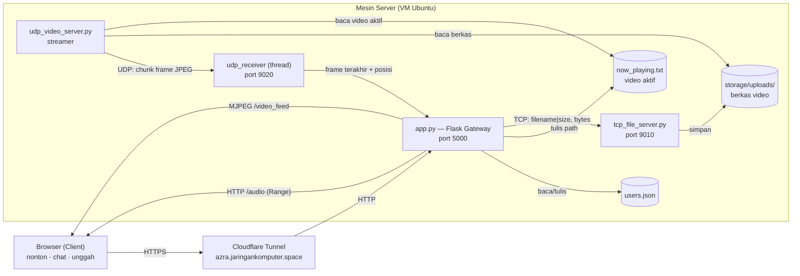
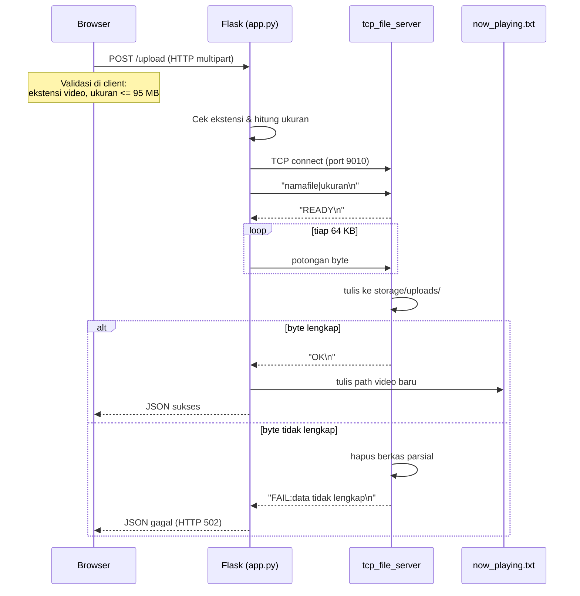
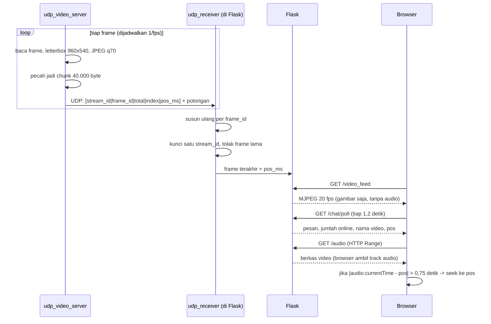
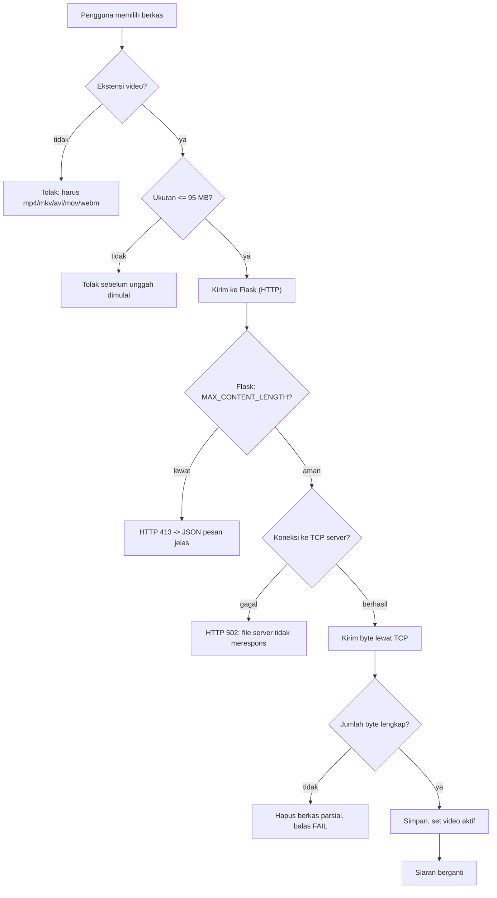

# Bahan Laporan UAS — CrowdCast

Isi siap salin ke dokumen/PDF. Bagian bertanda 🖼️ perlu kamu tempeli screenshot.

---

## 1. Judul dan Deskripsi Aplikasi

**Judul:** CrowdCast — Aplikasi Nonton Bareng Berbasis Web dengan Socket TCP dan UDP

**Deskripsi:**
CrowdCast adalah aplikasi client-server berbasis web untuk menonton video bersama-sama.
Terdapat satu "theater" global berisi satu video aktif. Setiap pengguna yang login dapat
mengunggah video untuk langsung menggantikan tontonan yang sedang berjalan, sementara seluruh
penonton melihat frame yang sama pada waktu yang sama, sambil mengobrol lewat live chat.

Aplikasi ini memakai **tiga protokol untuk tiga kebutuhan berbeda**:

| Protokol | Dipakai untuk | Alasan |
| --- | --- | --- |
| **TCP** (port 9010) | Unggah berkas video | Berkas harus utuh dan berurutan; satu byte rusak = video korup |
| **UDP** (port 9020) | Siaran video per-frame | Real-time; frame yang telat lebih baik dibuang daripada ditunggu |
| **HTTP** (port 5000) | Antarmuka, chat, audio | Perlu andal dan bisa di-*seek*; ditangani browser |

Catatan penting: ini **video streaming** (menyiarkan berkas video yang diunggah), **bukan live
camera**. Video dikirim sebagai rentetan gambar JPEG (MJPEG) lewat UDP, sehingga siaran tetap
berjalan meski kualitas turun atau ada frame yang hilang — ciri khas UDP.

---

## 2. Arsitektur Sistem

Aplikasi terdiri dari **tiga proses server terpisah** yang saling berkomunikasi lewat socket,
ditambah **browser** sebagai client.

| Proses | Peran | Protokol |
| --- | --- | --- |
| `app.py` | Web gateway (Flask): UI, login, chat, relay video, audio | HTTP (server), TCP (client), UDP (penerima) |
| `tcp_file_server.py` | Menerima & menyimpan berkas video | TCP (server) |
| `udp_video_server.py` | Membaca video aktif, menyiarkan frame | UDP (pengirim) |
| Browser | Client: menonton, chat, mengunggah | HTTP (client) |

Browser tidak dapat membuka socket TCP/UDP mentah, sehingga **Flask berperan sebagai gateway**:
Flask menjadi *client TCP* saat meneruskan unggahan, dan *penerima UDP* saat menerima frame.
Dengan begitu socket TCP dan UDP yang ditulis sendiri tetap benar-benar dipakai.

Penyimpanan tanpa basis data: pengguna disimpan di `users.json`, video aktif ditandai oleh
`videos/now_playing.txt`, sedangkan pesan chat dan status penonton disimpan di memori.

### Mermaid — Diagram Arsitektur



---

## 3. Diagram Komunikasi

### 3a. Alur unggah video (TCP)



### 3b. Alur siaran video (UDP) dan sinkronisasi audio (HTTP)



### 3c. Flowchart penanganan kegagalan unggah



> **Catatan untuk draw.io:** dukungan Mermaid di draw.io paling baik untuk `flowchart`/`graph`.
> Diagram `sequenceDiagram` (3a & 3b) sebaiknya di-render di <https://mermaid.live> lalu
> diekspor sebagai PNG/SVG, atau digambar ulang manual.

---

## 4. Penjelasan Implementasi

### 4.1 Unggah berkas lewat TCP
Flask menerima unggahan lewat HTTP, lalu bertindak sebagai **client TCP**. Protokol buatan sendiri:

```
Client → Server : <namafile>|<ukuran>\n
Server → Client : READY\n
Client → Server : <byte mentah sejumlah ukuran>
Server → Client : OK\n   atau   FAIL:<alasan>\n
```

Ukuran dikirim lebih dulu karena **TCP adalah aliran (stream) tanpa batas pesan** — tanpa tahu
jumlah byte, penerima tidak tahu kapan berkas selesai. Data dikirim per potongan 64 KB dan
tidak pernah dimuat seluruhnya ke memori, sehingga berkas besar tetap aman.

### 4.2 Siaran video lewat UDP
`udp_video_server.py` membaca video aktif dengan OpenCV, menyesuaikan tiap frame ke kanvas
960×540 **dengan menjaga rasio** (sisanya hitam, sehingga video potret tidak gepeng), lalu
mengodekannya menjadi JPEG (kualitas 70). Ukuran frame ±55 KB.

Karena satu datagram UDP dibatasi ±65 KB, tiap frame **dipecah menjadi beberapa chunk** dengan
header 16 byte:

```
| stream_id (4B) | frame_id (4B) | total (2B) | index (2B) | pos_ms (4B) |
```

Penerima menyusun ulang chunk berdasarkan `frame_id`. Bila ada chunk hilang, frame itu dibuang
dan siaran lanjut ke frame berikutnya — inilah perilaku khas UDP yang memang diinginkan.

**Tempo real-time.** Frame berikutnya dijadwalkan berdasarkan jam (`next_frame_at += 1/fps`),
bukan `sleep` tetap. Bila memakai `sleep(1/fps)`, waktu encode dan pengiriman ikut menambah
jeda sehingga siaran berjalan ±0,85× kecepatan asli.

**Anti streamer ganda.** Tiap proses streamer memiliki `stream_id` acak. Penerima mengunci satu
`stream_id` dan mengabaikan yang lain, hanya berpindah bila streamer terkunci diam > 2 detik.

### 4.3 Relay ke browser (HTTP)
Browser tidak bisa menerima UDP, sehingga Flask me-relay frame terakhir sebagai **MJPEG**
(`multipart/x-mixed-replace`) pada 20 fps. Karena seluruh penonton membaca *frame terakhir yang
sama*, mereka otomatis tersinkron.

### 4.4 Audio dan sinkronisasinya
Gambar tidak membawa suara, sehingga audio diambil terpisah lewat HTTP (`/audio`) dari berkas
video yang sama, dengan dukungan HTTP Range agar dapat di-*seek*. Penyelarasnya adalah `pos_ms`
(posisi putar) yang **dititipkan di header paket UDP**, sehingga waktu mengalir bersama framenya.

Klien menerima `pos` setiap 1,2 detik, dan menarik audio ke posisi itu bila selisihnya melebihi
0,75 detik (langsung dikoreksi bila ≥ 3 detik, misalnya saat video mengulang). Karena semua
penonton mengacu pada jam yang sama, mereka mendengar momen yang sama.

### 4.5 Chat dan kehadiran
Chat memakai **polling** tiap 1,2 detik (`GET /chat/poll?since=<id>`), mengembalikan hanya pesan
baru. Pengiriman lewat `POST /chat/send` (wajib login). Setiap penonton, termasuk yang belum
login, mendapat `viewer_id` di session dan dihitung "online" bila aktif dalam 10 detik terakhir.

### 4.6 Autentikasi dan email
Kata sandi disimpan sebagai hash (`werkzeug.security`), bukan teks polos. Saat registrasi,
sistem membuat kode OTP 6 digit (berlaku 5 menit, sekali pakai) dan mengirimkannya lewat Gmail
SMTP. Username tidak peka huruf besar/kecil dan spasi berlebih dipangkas.

### 4.7 Model akses
Menonton bersifat **publik**. Login hanya diwajibkan untuk **chat** dan **mengganti tontonan**.

---

## 5. Hasil Pengujian

### 5.1 Pengujian fungsional

| No | Skenario | Hasil |
| --- | --- | --- |
| 1 | Registrasi → OTP dikirim ke email → verifikasi → login | Berhasil |
| 2 | Unggah `clipB.mp4` | Menjadi siaran aktif |
| 3 | Unggah `clipC.mp4` | Siaran berganti, `clipB.mp4` terhapus otomatis |
| 4 | Unggah berkas non-video (`README.md`) | Ditolak, HTTP 400 |
| 5 | Unggah video > 95 MB | Ditolak di browser sebelum unggah dimulai |
| 6 | `GET /video_feed` | Frame mengalir (~123 KB dalam 2,5 detik) |
| 7 | Kirim chat, dibaca perangkat lain | Muncul < 2 detik, tidak duplikat |
| 8 | Anonim mengirim chat | Ditolak (dialihkan ke halaman login) |
| 9 | Chat kosong / > 300 karakter | Ditolak |
| 10 | Dua penonton aktif | Jumlah online = 2 |
| 11 | Video potret | Tampil dengan bilah hitam, tidak gepeng |
| 12 | Video habis | Mengulang dari awal |

### 5.2 Pengujian kualitas siaran

| Pengaturan | Rata-rata per frame | Chunk/frame | Bandwidth @ 30 fps |
| --- | --- | --- | --- |
| 640×360, JPEG 60 | 27,7 KB | 1 | 6,8 Mbps |
| 854×480, JPEG 70 | 46,9 KB | 2 | 11,5 Mbps |
| **960×540, JPEG 70** (dipakai) | ±55 KB | 2 | 8,8 Mbps @ 20 fps |

Resolusi dinaikkan agar teks pada video presentasi terbaca; laju relay diturunkan ke 20 fps agar
bandwidth tetap wajar.

### 5.3 Pengujian ketahanan (error handling)

| Skenario | Hasil |
| --- | --- |
| Dua `udp_video_server` berjalan bersamaan | 24 sampel posisi, **0 kali mundur** (streamer kedua diabaikan) |
| Tempo siaran | Maju 8,00 detik dalam 8,00 detik nyata → **0,999×** |
| Chunk UDP hilang | Frame dibuang, siaran lanjut |
| Frame datang terlambat | Diabaikan (hanya frame lebih baru ditampilkan) |
| `tcp_file_server` dimatikan lalu unggah | Pesan jelas: "File server (TCP) tidak merespons" |
| Unggah terputus di tengah | Berkas parsial dihapus, balas `FAIL` |
| 60 pesan chat menumpuk | Halaman **tidak memanjang** (0 px); panel chat menggulung sendiri |

### 5.4 Pengujian antarmuka

| Metrik | Hasil |
| --- | --- |
| Tinggi player vs panel chat (1280×800) | 484 px : 484 px |
| Warna nama untuk 6 pengguna | 6 warna berbeda, identik di semua perangkat |
| Tampilan di layar ponsel | Topbar 2 baris, tombol tidak bertabrakan |

### 5.5 Pengujian deployment

Seluruh sisi server (ketiga proses) dijalankan di **VM Ubuntu**, lalu diekspos lewat
**Cloudflare Tunnel** ke `https://azra.jaringankomputer.space`. Dengan begitu **client dan
server berjalan di mesin yang berbeda**: server di VM, sedangkan client (browser) diakses dari
perangkat lain — laptop maupun ponsel — melalui domain tersebut. Diuji dari ponsel via jaringan
seluler (di luar jaringan lokal) dan berhasil: video tampil, chat berjalan, jumlah penonton
bertambah.

> Catatan: karena client-nya browser yang berkomunikasi lewat **HTTP**, komunikasi lintas
> perangkat sudah terjadi pada lapisan HTTP (browser ↔ server di VM). Socket TCP dan UDP berperan
> sebagai jalur internal antar-proses di sisi server.

### 5.6 Bukti protokol (Wireshark)

**Saat mengunggah — filter `tcp.port == 9010`:** terlihat siklus koneksi TCP yang lengkap.
- **Pembukaan (three-way handshake):** `SYN` → `SYN, ACK` → `ACK`.
- **Transfer data:** paket `[PSH, ACK]` membawa potongan berkas, dibalas `[ACK]` di tiap paket,
  dengan nomor `Seq` yang terus bertambah — bukti pengiriman andal dan berurutan.
- **Penutupan:** `FIN, ACK` di kedua sisi (four-way termination).

**Saat menonton — filter `udp.port == 9020`:** terlihat **hanya datagram satu arah** dari server
ke penerima, **tanpa handshake dan tanpa ACK**. Server menembakkan frame tanpa menunggu
konfirmasi — kontras langsung yang menjelaskan pemilihan protokol: TCP menjamin keutuhan lewat
jabat tangan dan konfirmasi, UDP mengutamakan kecepatan tanpa keduanya.

**Perbandingan langsung dari kedua tangkapan layar:**

| Aspek | TCP (unggah, port 9010) | UDP (streaming, port 9020) |
| --- | --- | --- |
| Pembukaan koneksi | Ada — three-way handshake (SYN, SYN-ACK, ACK) | Tidak ada |
| Arah paket | Dua arah (client ↔ server) | Satu arah (server → penerima) |
| Konfirmasi (ACK) | Ada di tiap paket | Tidak ada |
| Nomor urut (Seq) | Ada, bertambah — menjamin urutan | Tidak ada |
| Penutupan | Ada — FIN, ACK (four-way) | Tidak ada |
| Sifat | Andal, utuh, berurutan | Cepat, tanpa jaminan |

Kesimpulan: TCP menjamin keutuhan melalui jabat tangan, konfirmasi, dan penomoran; UDP
mengutamakan kecepatan dengan menembakkan datagram tanpa semua itu.

🖼️ *Tempel dua tangkapan layar: (1) TCP `tcp.port==9010` — sertakan paket SYN di awal;
(2) UDP `udp.port==9020`.*

---

## 6. Screenshot yang Perlu Diambil

1. 🖼️ Halaman theater (video + live chat) di desktop.
2. 🖼️ Halaman login dan halaman registrasi.
3. 🖼️ Email OTP yang diterima + halaman verifikasi.
4. 🖼️ Proses unggah (progress bar) dan notifikasi
   *"… diupload via TCP (35.0 MB) — sekarang disiarkan via UDP."*
5. 🖼️ Terminal **SSH di VM** menjalankan `run.py` — log `[tcp] [udp] [web]` (server di VM,
   komunikasi antar proses).
6. 🖼️ Terminal **SSH di VM** menjalankan `cloudflared tunnel run` (connector di VM).
7. 🖼️ Wireshark: `tcp.port == 9010` (saat unggah).
8. 🖼️ Wireshark: `udp.port == 9020` (saat siaran).
9. 🖼️ Aplikasi dibuka dari **perangkat lain** (laptop/ponsel) via domain publik — bukti client
   dan server berada di mesin berbeda.
10. 🖼️ Dua perangkat menonton bersamaan + chat (bukti sinkron & multi-client).
11. 🖼️ Dashboard Cloudflare Tunnel status **Healthy**.
12. 🖼️ Pesan error saat unggah gagal (mis. berkas > 95 MB).

---

## 7. Jawaban Pertanyaan

### 7.1 Protokol jaringan apa yang digunakan? Jelaskan alasannya.

Tiga protokol, masing-masing dipilih sesuai sifat datanya.

- **TCP** untuk mengunggah berkas video. TCP menjamin data sampai lengkap dan berurutan, serta
  mengirim ulang paket yang hilang. Berkas video harus utuh: satu byte rusak dapat membuat
  video gagal dibuka. Kelambatan dapat diterima karena unggahan bukan proses real-time.
- **UDP** untuk menyiarkan video. Siaran mengutamakan kecepatan; frame yang terlambat sudah
  tidak berguna. UDP tidak mengirim ulang paket hilang, sehingga siaran tetap berjalan meski
  ada frame yang gugur — persis yang diinginkan. Frame yang hilang hanya membuat gambar
  tersendat sesaat, bukan menghentikan siaran.
- **HTTP** untuk antarmuka, chat, dan audio. Browser hanya dapat berbicara HTTP/WebSocket, tidak
  bisa membuka socket UDP/TCP mentah. Audio juga perlu utuh dan dapat di-*seek*, sehingga
  cocok dengan HTTP (mendukung Range request).

Perlu ditegaskan: **UDP bukan penyebab hilangnya audio.** UDP mampu membawa audio (VoIP dan
WebRTC memakainya). Audio tidak ada karena video dikirim sebagai rentetan gambar JPEG, dan
gambar memang tidak membawa suara. Karena itu audio ditambahkan lewat jalur HTTP terpisah.

### 7.2 Bagaimana mekanisme komunikasi antara client dan server?

Terdapat empat jalur komunikasi:

1. **Browser ↔ Flask (HTTP).** Browser meminta halaman, mengirim unggahan, mengambil chat
   (polling 1,2 detik), menerima siaran MJPEG, dan mengambil audio.
2. **Flask → `tcp_file_server` (TCP).** Saat ada unggahan, Flask menjadi client TCP: mengirim
   header `namafile|ukuran`, menunggu `READY`, mengirim byte per 64 KB, lalu menunggu `OK`.
3. **`udp_video_server` → Flask (UDP).** Streamer membaca video aktif, mengubah tiap frame
   menjadi JPEG, memecahnya menjadi chunk berheader, dan mengirimkannya. Penerima di dalam
   Flask menyusunnya kembali dan menyimpan frame terakhir.
4. **Flask → Browser (HTTP).** Frame terakhir di-relay sebagai MJPEG; karena semua penonton
   membaca frame yang sama, siaran otomatis tersinkron.

Koordinasi antar proses dilakukan lewat berkas penunjuk `now_playing.txt` (video mana yang
aktif) dan lewat `pos_ms` yang dititipkan di header paket UDP (posisi putar, untuk menyelaraskan
audio).

### 7.3 Bagaimana aplikasi menangani kesalahan koneksi atau kegagalan pengiriman data?

Penanganan dilakukan **berlapis, dan diusahakan gagal sedini mungkin**:

**Sebelum data dikirim (browser).** Ekstensi dan ukuran berkas diperiksa lebih dulu. Berkas
lebih dari 95 MB langsung ditolak tanpa memulai unggahan, sehingga pengguna tidak menunggu
sia-sia. Batas 95 MB dipilih karena Cloudflare (plan gratis) menolak badan permintaan di atas
100 MB; batas aplikasi disesuaikan dengan batas infrastruktur agar kegagalan terjadi lebih awal
dan dapat dijelaskan, bukan berhenti misterius di tengah transfer.

**Di sisi Flask.** `MAX_CONTENT_LENGTH` membatasi ukuran permintaan; kesalahan 413 dibalas dalam
bentuk JSON (bukan halaman HTML) agar pesan tetap terbaca oleh antarmuka. Bila `tcp_file_server`
tidak merespons, pengguna menerima pesan spesifik, bukan sekadar "gagal".

**Di jalur TCP.** Socket diberi batas waktu 60 detik dan selalu ditutup di blok `finally`.
Kegagalan koneksi ditangkap dan diterjemahkan menjadi pesan yang dapat dibaca manusia. Bila
jumlah byte yang diterima tidak sama dengan yang dijanjikan, server **menghapus berkas parsial**
lalu membalas `FAIL` — berkas rusak tidak pernah disimpan.

**Di jalur UDP.** Kehilangan data memang diterima sebagai konsekuensi. Bila ada chunk yang
hilang, frame tersebut dibuang dan siaran melanjut ke frame berikutnya. Frame yang datang
terlambat diabaikan agar gambar tidak melompat mundur. Bila dua streamer berjalan bersamaan,
penerima mengunci satu `stream_id` dan mengabaikan yang lain.

**Di sisi aplikasi.** Chat kosong atau melebihi 300 karakter ditolak; pengguna anonim yang
mencoba mengirim chat dialihkan ke halaman login; OTP kedaluwarsa setelah 5 menit dan hanya
dapat dipakai sekali; permintaan `/audio` ketika belum ada siaran dibalas HTTP 404.

### 7.4 Apa kelebihan dan kekurangan implementasi ini?

**Kelebihan**

- Memakai tiga protokol sesuai kebutuhan, bukan satu protokol untuk segalanya.
- Frame dipecah menjadi chunk, sehingga resolusi tidak dibatasi ukuran satu datagram UDP
  (±65 KB). Implementasi yang mengirim satu frame per datagram terpaksa memakai resolusi rendah.
- Rasio video dijaga (letterbox), sehingga video potret tidak gepeng.
- Sinkronisasi otomatis: seluruh penonton membaca frame terakhir yang sama.
- Audio ditambahkan tanpa mengorbankan konsep siaran, dengan menyelaraskan ke jam server.
- Tahan terhadap streamer ganda dan frame yang datang tidak berurutan.
- Tanpa basis data, sehingga mudah dijalankan dan diperiksa.
- Sudah dideploy dan dapat diakses publik lewat DNS Cloudflare.

**Kekurangan**

- **Tanpa audio pada jalur UDP.** Audio berjalan di jalur HTTP terpisah dan sinkronisasinya
  bersifat perkiraan (toleransi 0,75 detik), bukan akurat per-frame.
- **MJPEG boros bandwidth.** Setiap frame adalah gambar utuh tanpa kompresi antar-frame,
  sehingga jauh lebih berat daripada codec modern seperti H.264.
- **Tiap penonton menerima aliran MJPEG sendiri**, sehingga beban unggah server naik linear
  terhadap jumlah penonton.
- **Status disimpan di memori.** Pesan chat dan daftar penonton hilang saat server dimulai ulang.
- **Hanya satu theater global**, tidak ada ruangan terpisah.
- Masih memakai server pengembangan Flask, bukan server WSGI produksi.
- Audio hanya berbunyi bila codec berkas didukung browser.

### 7.5 Pengembangan agar lebih aman, cepat, dan andal

Beberapa arah pengembangan yang dapat dilakukan (masing-masing sering memperbaiki lebih dari
satu aspek sekaligus):

- Mengganti pipeline MJPEG dengan protokol media modern seperti **RTP/WebRTC** — memakai kompresi
  antar-frame (lebih hemat bandwidth), membawa audio-video tersinkron dalam satu aliran, dan
  terenkripsi secara bawaan.
- Memakai **SFU** (Selective Forwarding Unit) agar server cukup menerima satu aliran lalu
  meneruskannya ke banyak penonton, sehingga beban tidak membengkak seiring jumlah penonton.
- Menerapkan **adaptive bitrate** — kualitas turun otomatis saat jaringan melemah.
- Menjalankan di belakang **server WSGI produksi** (Gunicorn/Waitress) dengan reverse proxy dan
  pengawas proses (systemd/supervisor) agar stabil dan pulih sendiri.
- Memindahkan status (chat, sesi) ke penyimpanan persisten seperti **Redis** agar tidak hilang
  saat restart, dan berkas ke **object storage** (mis. Cloudflare R2) agar diska tidak penuh.
- Menambahkan **rate limiting**, **CSRF token**, dan validasi berkas berdasarkan isi (magic
  number) untuk mencegah penyalahgunaan.
- Memakai basis data dengan kontrol akses dan audit log, serta **Cloudflare Access** untuk
  membatasi siapa yang dapat membuka aplikasi.
- Menambahkan pengujian otomatis untuk jalur TCP dan UDP.

---

## 8. Kesimpulan

CrowdCast berhasil mengimplementasikan komunikasi client-server menggunakan tiga protokol
jaringan sekaligus, dengan pemilihan yang disadari: **TCP** untuk unggahan yang menuntut
keutuhan data, **UDP** untuk siaran video yang menuntut kecepatan dan menoleransi kehilangan
paket, serta **HTTP** untuk antarmuka dan audio.

Pengujian membuktikan bahwa aplikasi berjalan sesuai rancangan: berkas berpindah utuh lewat TCP,
frame video mengalir lewat UDP dan tetap berjalan meski ada paket hilang, seluruh penonton
melihat frame yang sama, dan aplikasi dapat diakses publik melalui DNS Cloudflare.

Beberapa keterbatasan — terutama tidak adanya audio pada jalur UDP dan borosnya MJPEG — bukan
kesalahan implementasi, melainkan **konsekuensi yang dipahami** dari pendekatan yang dipilih.
Keterbatasan tersebut justru memperjelas alasan protokol media seperti RTP/WebRTC ada, dan
menjadi arah pengembangan berikutnya.

Melalui tugas ini penulis memahami bahwa pemilihan protokol bukan soal mana yang "lebih baik",
melainkan **mana yang sesuai dengan sifat data yang dikirim**.
